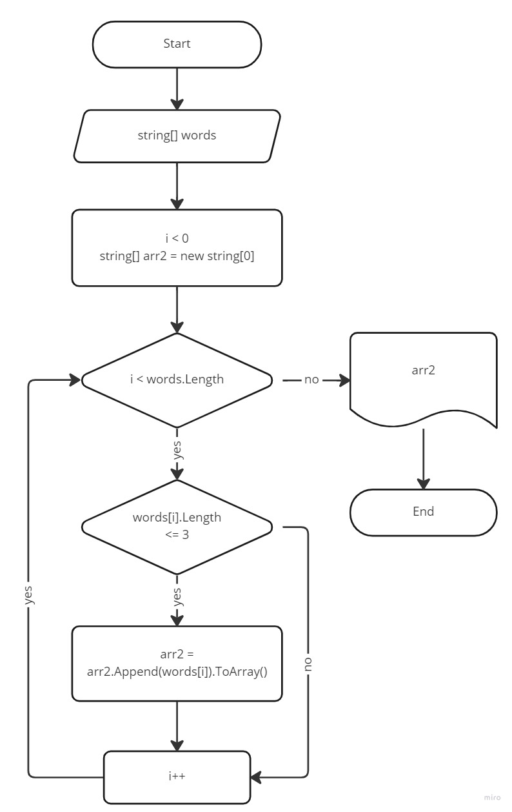

# **КОНТРОЛЬНАЯ РАБОТА** #
# по итогам 1 четверти #
# **студентка Живницкая Анна** #

### курс "Цифровые профессии. Разработчик Python" ###

1. Создан репозиторий на GitHub
1. Решена задача:

* "Написать программу, которая из имеющегося массива строк формирует новый массив строк, длина которых меньше или равна трем."
* нарисована блок-схема основной части задачи

3. Решение выгружено в репозиторий
